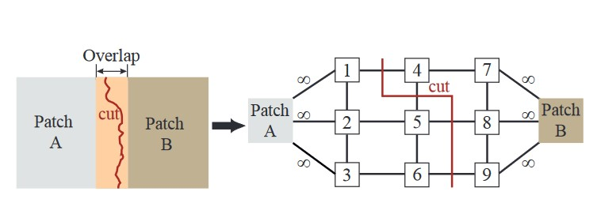
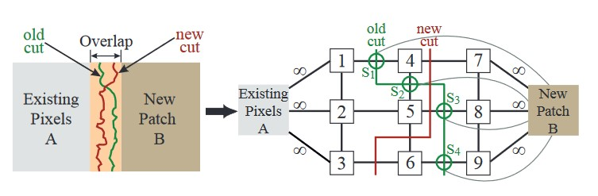
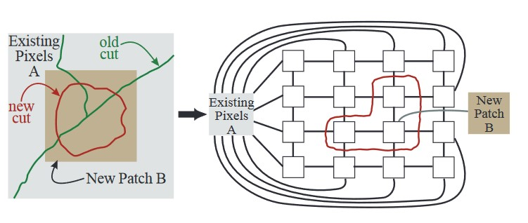
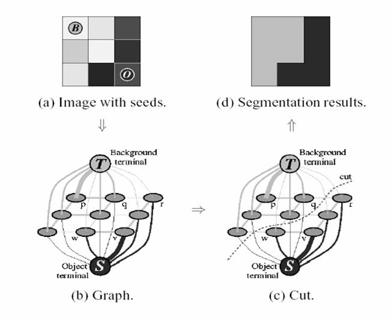

#   Grabcut and Graph Textures
## 问题
### Graph Textures
通过一张较小的纹理图像（input），生成一张较大的纹理图像（output），使得生成的纹理图像是原图像的无缝拼接，符合人类视觉感知。
### Grabcut
给定图片，通过一定的用户交互，将其背景与前景分离，得到前景图像。
## 实验原理与过程
### Graph Textures

1. 新建一个mask变量作为纹理合成的结果，初始化为全黑。
2. 对mask进行Initialize操作。为简单起见，将mask由上到下、从左到右间隔一定距离(程序中为一定范围内的随机数)依次填入input图像，
3. 在每次填入的过程中保证与前一张图片有重叠部分。填入该张图片后，对该图片与前一张图片构成的图进行最大流最小割算法，进行图像合成。完成后进行下一张图片的填入。

4. 如图1所示，A表示前一张图片，B表示当前插入的图片。将两张图片重叠区域中的每个像素点看作一个节点，将每个节点与其周围上下左右4个节点相连，节点之间的边的权重由两个像素点的颜色差异计算得到，令$s,t$分别为重叠区域的两个节点，$A(s),B(s)$分别为$s$节点在前一张图片和当前图片的颜色值，则$s$与$t$之间的边的权重为$w(s,t)=M(s,t,A,B)=||A(s)-B(s)||+||A(t)-B(t)||$，其中$||\cdot ||$在本次实验中为R、G、B三个通道各自计算后的平均值。
5. 除此之外，增加两个节点：source（A）作为前一张图片的代表、sink（B）作为当前图片的代表，重叠区域边界点如果是上一张图片的内部点则与source相连，否则与sink相连，边的权重为$\infty$。最大流最小割算法的结果即为前一张图片与当前图片的拼接缝（seam）。
    

6. 如图2所示，若重叠区域已有之前的拼接缝存在，那么在之前的接缝处的两个节点s,t之间添加新的节点（seam node），此时A作为图片合成的中间结果，B作为当前插入的图片，$A_s$表示A中s节点来自的图片。将seam node与
周围的2个节点s,t以及sink（B）相连，边的权重分别为$w(sink,seam node)=M(s,t,A_s,A_t), w(s,seam node)=M(s,t,A_s,B), w(t,seam node)=M(s,t,A_t,B)$。

7. 在得到的mask图像上随机位置填入input图像，进行Optimize操作，优化合成结果。
    
8. 如图3所示，不考虑过去合成的seam，当前插入的图片（B）与mask图像（A）的重叠区域的每个像素点看作一个节点，与周围上下左右4个节点相连，边的权重与Initialize操作中的计算方式相同，边界点与source（A）相连，边的权重为$\infty$，在图像内部选取一个节点与sink（B）相连，边的权重为$\infty$。最大流最小割算法的结果即为当前插入的图片与mask图像的拼接缝（seam）。

### Grabcut

1. 读取用户输入的矩形区域，将区域外的像素点标记为背景，区域内的像素点待定。
    
2. 图片中的每个像素点看作一个节点，与周围上下左右4个节点相连，并添加两个节点：source（foreground）
与sink（background），每个节点均与source与sink相连。节点s，t之间的权重为两个像素之间的颜色相似度，相似度越高，边的权重越大。节点s与source相连边的权重为作为foreground的概率，与sink相连边的权重为作为background的概率。
3. 若s是矩形区域外的节点，初始值为$w(s,source)=0,w(s,sink)=\infty$；若s是矩形区域内的节点，初始值由Gaussian Mixture Model根据图像数据计算得到。
4. 在图中进行最大流最小割算法，得到分割结果。
5. 重复步骤2、3，直到分割结果收敛。（本次实验迭代次数为1）
6. 后续用户交互可改变节点s与source、sink之间的边的权重，从而改变分割结果。本次实验每次用户交互后均重新进行1次grabcut算法。

## 程序说明

1. 本次实验使用Python(3.10.14)语言编写，主要使用了Opencv库进行图像处理，Numpy库进行数组操作，Networkx库进行最大流最小割算法等图论操作。具体版本见requirements.txt文件。
2. 直接由Graph Textures项目主页下载的图片无法由Opencv读取，变量仍会存在但内容为None，在进行后续操作时会报错。本次实验中使用屏幕截图的方式得到原主页上图片的.jpg格式，对图像进行缩放为$64 \times 64$大小后再进行处理。
3. 本次实验程序代码均可直接点击运行，Graph Textures部分的默认设置为将$64 \times 64$大小的Green.jpg图片合成为$256 \times 256$大小的result.jpg图片；Grabcut部分的默认设置为对animal.jpg图片进行图像分割。由于默认设置为相对路径，使用默认设置时，\textbf{请在Experiment文件夹下运行}。
4. 若要对给定的图片进行处理，Graph Textures部分的运行设置为“python main.py path/to/your/image.jpg path/to/your/output.jpg width height”;Grabcut部分的运行设置为“python main.py path/to/your/image.jpg”。
5. Graph Textures中由于原图片在mask中每次添加时的位置有一定随机性，运行时可能会出现数组越界的情况，可能是由于边界处的情况未能处理好，但发生概率较低，重新运行即可。
6. 实验过程由Opencv窗口进行可视化，可看到纹理合成和图像分割的效果，可通过终端窗口查看按键操作提示与程序运行情况。
7. Graph Textures的运行时间大约$5\thicksim 15$分钟，与图片复杂度等因素有关。

## References
[1] V. Kolmogorov和R. Zabin, 《What energy functions can be minimized via graph cuts?》, IEEE Transactions on Pattern Analysis and Machine Intelligence, 卷 26, 期 2, 页 147–159, 2月 2004, doi: 10.1109/TPAMI.2004.1262177.

[2] 《OpenCV: Interactive Foreground Extraction using GrabCut Algorithm》. 见于: 2024年6月19日. [在线]. 载于: https://docs.opencv.org/4.9.0/d8/d83/tutorial_py_grabcut.html

[3] V. Kwatra, A. Schödl, I. Essa, G. Turk和A. Bobick, 《Graphcut textures: image and video synthesis using graph cuts》, ACM Trans. Graph., 卷 22, 期 3, 页 277–286, 7月 2003, doi: 10.1145/882262.882264.

[4] C. Rother, V. Kolmogorov和A. Blake, 《〈GrabCut〉: interactive foreground extraction using iterated graph cuts》, ACM Trans. Graph., 卷 23, 期 3, 页 309–314, 8月 2004, doi: 10.1145/1015706.1015720.
